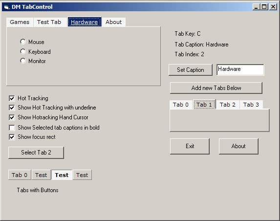



## DM Tab Control

### Description

Hi this is a little Tab Control I made about 2 hours ago, It was just ment to be a simple control but as you start on something you can never stop. code is quite easy and mostly is done with the line function, only 3 API call used. the resrt is just Pure VB Code

anyway some of it's features include:

Show Hottracking,Change hottracking color,Show or hide hottracking underline,Show of hide Highlighted Tabs like in the normal vb on,Show of hide focus rect,Chnage the tab style between Tabs or Buttons and much more. if I have time I try and update this project agian if you like. Please vote.

Hope you find it usfull.
 
### More Info
 

             |
---                |---
**Submitted On**   |2005-07-24 13:05:20
**By**             |[dreamvb](https://github.com/Planet-Source-Code/PSCIndex/blob/master/ByAuthor/dreamvb.md)
**Level**          |Intermediate
**User Rating**    |4.8 (24 globes from 5 users)
**Compatibility**  |VB 6\.0
**Category**       |[OLE/ COM/ DCOM/ Active\-X](https://github.com/Planet-Source-Code/PSCIndex/blob/master/ByCategory/ole-com-dcom-active-x__1-29.md)
**World**          |[Visual Basic](https://github.com/Planet-Source-Code/PSCIndex/blob/master/ByWorld/visual-basic.md)
**Archive File**   |[DM\_Tab\_Con1916967242005\.zip](https://github.com/Planet-Source-Code/dreamvb-dm-tab-control__1-61884/archive/master.zip)

